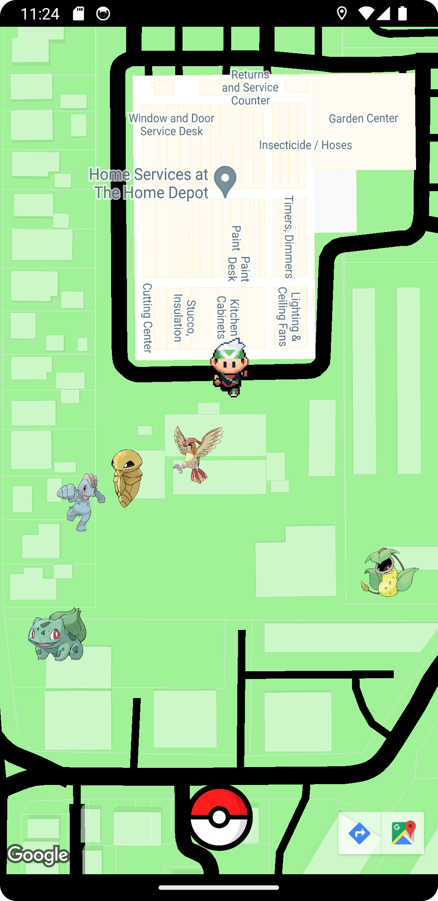
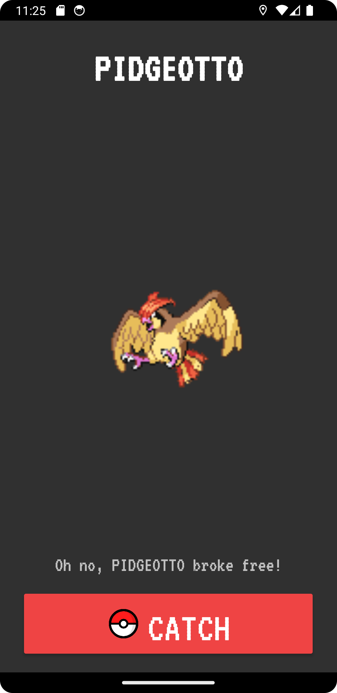
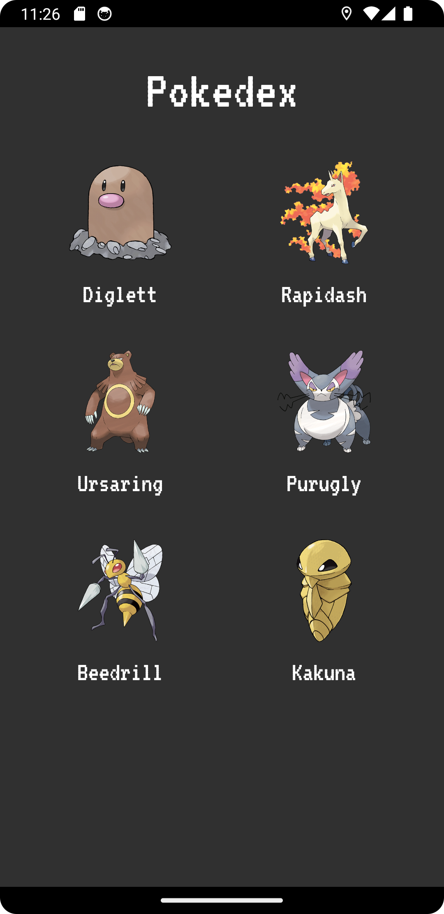
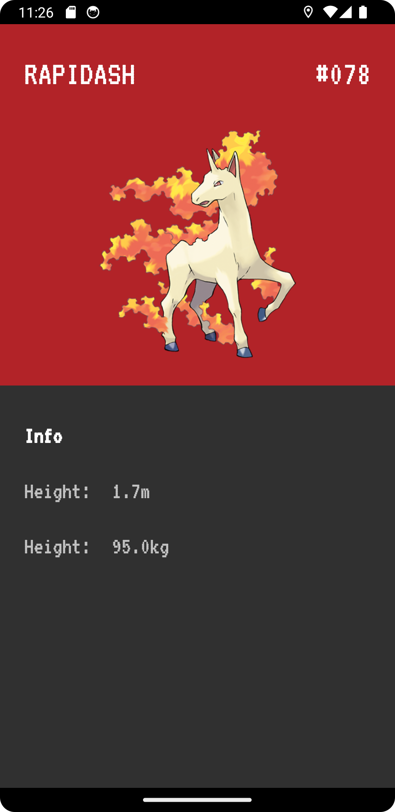

# Budget Pokémon Go

- A clone version of Pokémon Go game.
- This app could be used for entertainment purpose or user who are interested in knowing
  more about Pokémon’s information.

## Table of contents
- [Screenshots](#screenshots)
- [Built with](#built-with)
- [Demo](#demo)
- [Author](#author)

## Screenshots
### Pokemon Maps & Catching
<p float="left">
  
  
</p>

### Pokedex
<p float="left">
  
  
</p>

## Demo
You can try out this budget application by downloading this repo and then add your Google Maps 
API Key like the following in `local.properties` file.

The key can be generated from **Keys & Credentials** in Googles Maps Platform.

```
MAPS_API_KEY="YOUR API KEY"
```

## Built with
- [Kotlin (Android Studio)](https://developer.android.com/studio)
- [Google Maps Platform](https://mapsplatform.google.com/)
- [PokeAPI](https://pokeapi.co/)

## Author

- Website - [Tien Trinh](https://tientrinh.netlify.app/)
